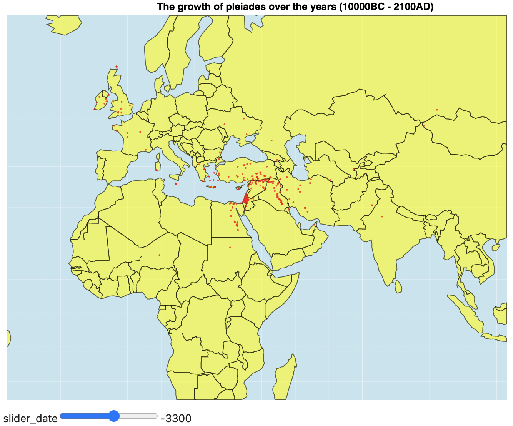
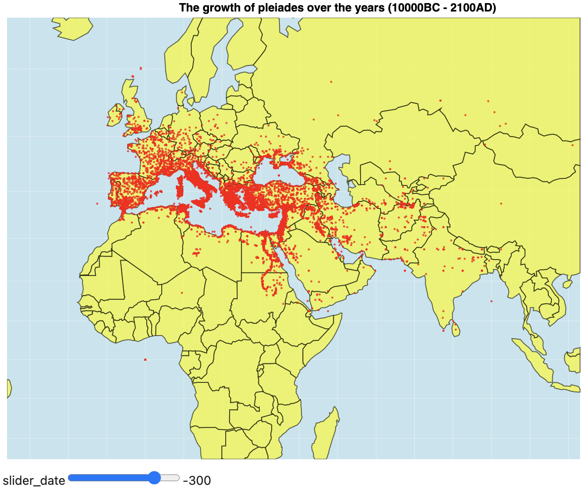
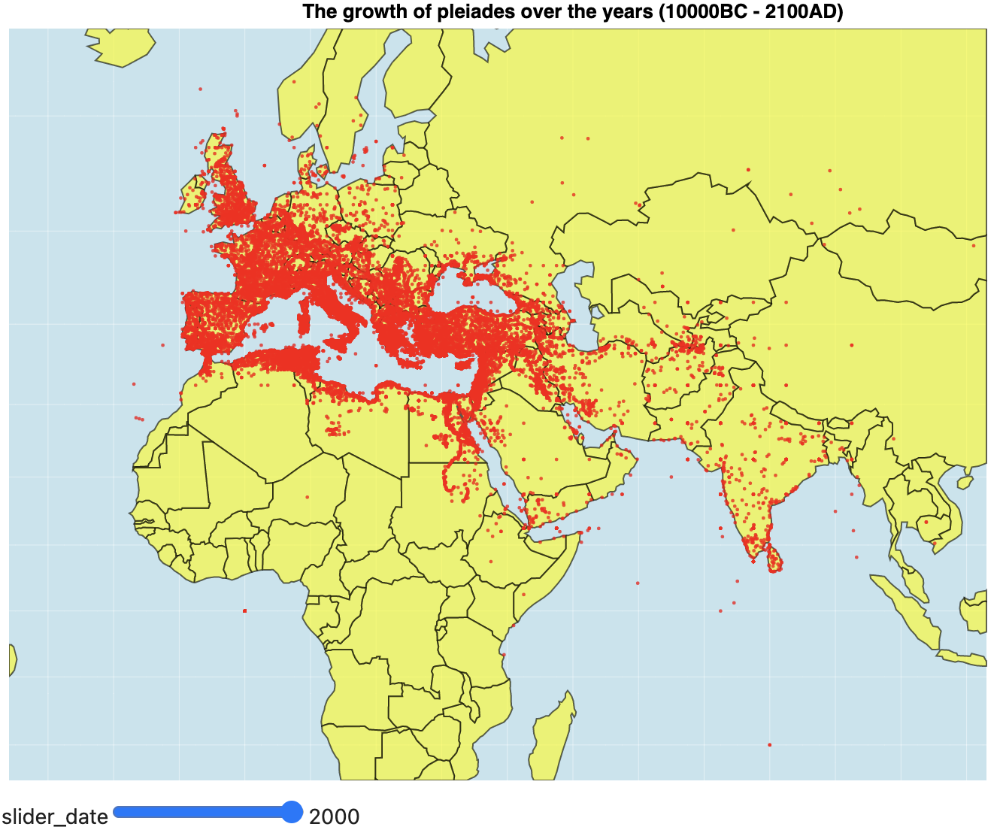

---
narrative-schemas:
  - coursework
---

Author: Anton Dementyev (2023638)
CSCM37 Coursework 1: Information Visualization

# The growth of pleiades over the years (10000BC - 2100AD)

There are 3 data files from [Pleiades](https://pleiades.stoa.org/). For this series of visualizations we use the Pleaides Locations data set. For simplicity, we have renamed it to 'pleiades.csv'.

##### Setup
```python
import altair as alt
import pandas as pd
from vega_datasets import data
```


```python
mp = data.world_110m.url
```


```python
df = pd.read_csv('pleiades.csv')
```

## Getting started


{(aim|}
The goal of this visualization is to show the dynamics of the growth of the pleiades over the 12000-year period. For the date of emergence we take the minimal date (minDate) mentioned in the data set. As a result, we can see how the map is being filled with new locations upon interaction with time.
{|aim)}

{(vistype|}
Geograhic map 
{|vistype)}

### Altair code

```python
alt.data_transformers.disable_max_rows()
alt.renderers.enable('html')

slider = alt.binding_range(
    step=100,
    min=-10000, 
    max=df.maxDate.max()
)

select_date = alt.selection_single(
    name="slider", 
    fields=['date'],
    bind=slider, 
    init={"date": -10000}
)

sphere = alt.sphere()
graticule = alt.graticule()

source = alt.topo_feature(mp, 'countries')
data = alt.Chart(df).mark_circle(size=5, color='red').encode(
    longitude='reprLong:Q',
    latitude='reprLat:Q',
).add_selection(select_date).transform_filter(
    "datum.minDate <= slider.date[0]"
)

chart = alt.layer(
    alt.Chart(sphere).mark_geoshape(fill='lightblue', opacity=0.7),
    alt.Chart(graticule).mark_geoshape(stroke='white', strokeWidth=0.3, opacity=0.8),
    alt.Chart(source).mark_geoshape(fill='yellow', stroke='black', opacity=0.6),
    data
).project(
    'mercator',
    scale=250,
    center=[50, 30],
    clipExtent=[[0, 0], [650, 500]],
).properties(
    width=750, 
    height=500, 
    title='The growth of pleiades over the years (10000BC - 2100AD)'
).configure_view(stroke=None)
```


```python
chart
```

### Examples & interaction
<br/>
<br/>
<br/>

{(vismapping|}

x position
: reprLong - longitude

y position
: reprLat - latitude

{|vismapping)}

{(dataprep|}

Cleaning from null values.

{|dataprep)}

```python
df = df[df.timePeriodsRange.notnull()]
```

{(limitations|}
It is very memory consuming, since each point has to be rendered individually. However, merging points which are close to each other into one does not solve the issue due to unstable size. A solution could be to use a choropleth map and it is used further for one of the followup designs.
{|limitations)}
