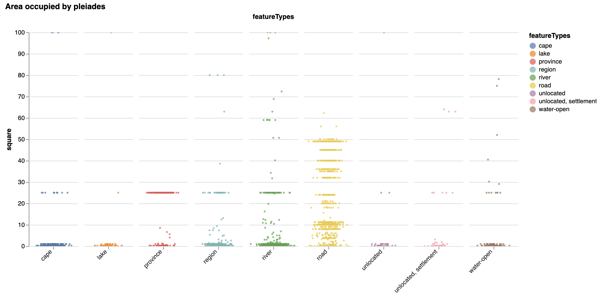
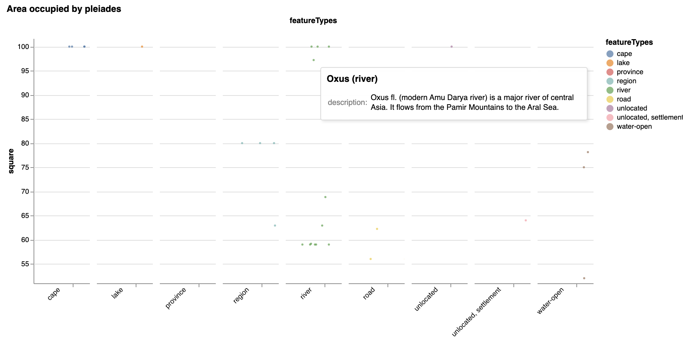

# Area occupied by the pleiades

##### Setup
```python
import altair as alt
import pandas as pd
from vega_datasets import data
import numpy as np
import math
```


```python
df = pd.read_csv('pleiades.csv')
```

{(aim|}

The goal of this visualization is a bit abstract. We believe it can help identify interesting observations with respect to the improvised spatial dimensions of the locations represented by the box formed by coordinates (bbox field). The visualization is aimed to find single observations detached from the main cohort (outliers, but not too extreme - explained further). This can enable interesting analysis of these locations and establishing the causes of their differencies.

{|aim)}

{(vistype|}

Scatter plot (columned)

{|vistype)}

### Altair code

```python
chart = alt.Chart(df).mark_circle(size=9).encode(
    x=alt.X(
        'jitter:Q',
        title=None,
        axis=alt.Axis(values=[0], ticks=True, grid=False, labels=False),
        scale=alt.Scale(),
    ),
    y='square:Q',
    color='featureTypes:N',
    tooltip=['title:N', 'description:N'],
    column=alt.Column(
        'featureTypes:N',
        header=alt.Header(
            labelAngle=-45,
            titleOrient='top',
            labelOrient='bottom',
            labelAlign='right',
            labelPadding=5,
        ),
    ),
).transform_calculate(
    jitter='sqrt(-2*log(random()))*cos(2*PI*random())'
).properties(
    width=80,
    height=350,
    title="Area occupied by pleiades"
).configure_facet(
    spacing=10
).configure_view(
    stroke=None
).interactive()
```

```python
chart
```

### Examples & interaction
<br/>
If we zoom in on a column:
<br/>

{(vismapping|}

x  position
:   featureTypes / category (Nominal)

y  position
: square (retrieved from the bounding coordinate box - "bbox" field)

within a column random jitter is applied to x-axis

Color: featureTypes (Nominal)

{|vismapping)}

{(dataprep|}

We need to calculate the square for each location, group the data set by category (featureTypes), then calculate the standard deviation within each category and sort from highest to lowest to maximize the chance of getting interesting results. Also, we remove extreme outliers and categories with a small count of observations (the latter is explained in the code). 

{|dataprep)}

```python
def get_square(loc_str):
    arr = loc_str.split(',')
    if len(arr) == 4: 
        res = (float(arr[2]) - float(arr[0])) * (float(arr[3]) - float(arr[1]))
        if res > 0:
            return res
        else:
            return 0
    else:
        return 0
```


```python
df['bbox'] = df['bbox'].astype(str)
df['square'] = df.apply(lambda row: get_square(row.bbox), axis=1)
```

The upper boundary we are setting is aimed to delete extreme outliers (e.g., seas, islands, etc.) and <b>helps maintain overall coherence of the scatter plot.</b>

```python
# removing 0 square and outliers (101 is an empirical value)
df = df[(df['square'] > 0) & (df['square'] <= 101)]
```


```python
gb = df.groupby(['featureTypes'])
# sorting by the highest std of the square
sorted_gb = gb.agg(np.std, ddof=1).reset_index().sort_values('square', ascending=False).head(15)
most_std = sorted_gb['featureTypes'].to_numpy()
```


```python
k = gb.size().reset_index(name='counts').sort_values('counts', ascending=False)
```


```python
# this code can be used to set a value for the count of the location in a category
# since we are relying on std, we would want to have more condidence by increasing the value
k = k[k['counts'] > 10]
count_pass = k['featureTypes'].to_numpy()
intersect = np.intersect1d(most_std, count_pass)
df = df[df['featureTypes'].isin(intersect)]
```

{(limitations|}

Zooming in & out is required to pick a desired location. Hence, getting back to the initial position where all observations are visible can take some time. Also, due to the nature of the data set, (even with the use of jitter) a lot of points are merged together and require further zooming in. Finally, a lot of bounding boxes of the observations in the data set are in fact just a point (have no square), so the scope of this visualization is quite limited.

{|limitations)}
