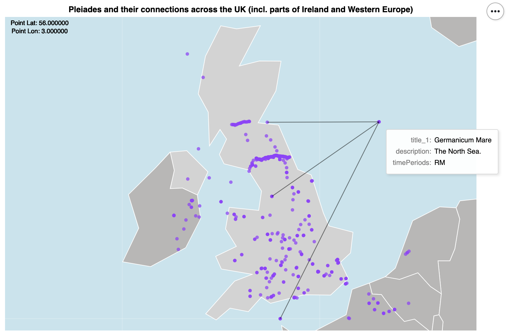
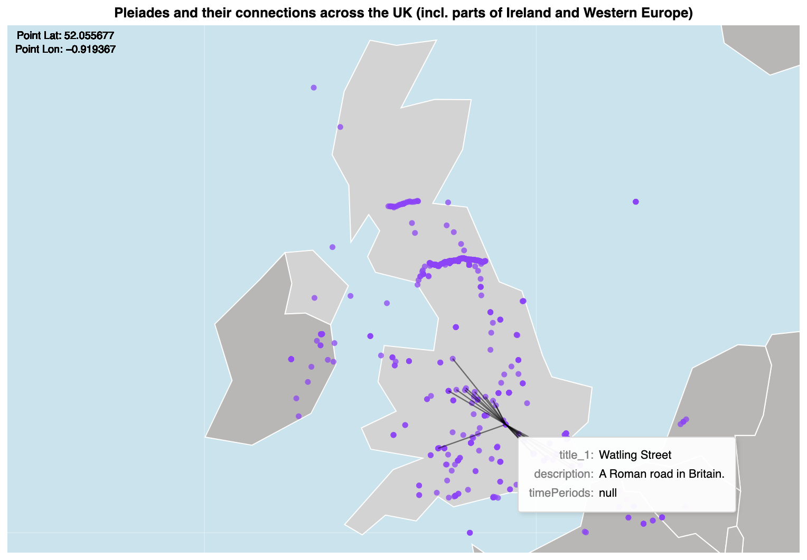
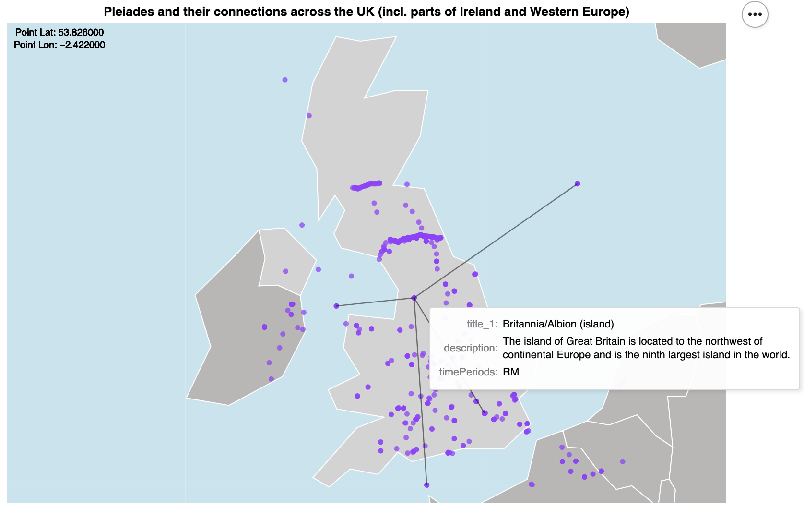

# Pleiades and their connections across the UK

##### Setup
```python
import altair as alt
import pandas as pd
from vega_datasets import data
```


```python
mp = data.world_110m.url
```


```python
df = pd.read_csv('pleiades.csv')
```

{(aim|}
This visualization enables studying the connections of the Pleaides locations across the UK. We believe that with the aid of this visualization people should be able to retrace the links and origin of a majority of the locations. Exact coordinates of the locations are provided in the top left corner and a tooltip appears upon hovering over a location to fulfill "details on demand". This help reduce visual clutter and allows to point out interesting connections based on the expanded info. 
{|aim)}

{(vistype|}
Geographic map
{|vistype)}

### Altair code

```python
select_point = alt.selection_single(on="mouseover", nearest=True, fields=["origin"], empty="none")

mp = data.world_110m.url
source = alt.topo_feature(mp, 'countries')

globe = alt.Chart(alt.sphere()).mark_geoshape(fill='lightblue', opacity=0.7)
meridian = alt.Chart(alt.graticule()).mark_geoshape(stroke='white', strokeWidth=0.3, opacity=0.8)

# the ID of the UK is 826 in "world_110m" => if not the UK, then apply a different color
background = alt.Chart(source).mark_geoshape(
    stroke="white",
).encode(
    color=alt.condition(alt.datum.id == 826, alt.value('lightgray'), alt.value('#B8B7B6'))
)

# displaying latitude of a point (circle)
text_lat = alt.Chart(final).mark_text(dy=-227, dx=-320, size=10).encode(
    text='label:N',
).transform_filter(
    select_point
).transform_calculate(
    label=f'"Point Lon: " + format(datum.reprLong_1,".6f")'
)

# displaying longitude of a point (circle)
text_lon = alt.Chart(final).mark_text(dy=-240, dx=-320, size=10).encode(
    text='label:N',
).transform_filter(
    select_point
).transform_calculate(
    label=f'"Point Lat: " + format(datum.reprLat_1,".6f")'
)

# connecting points
connections = alt.Chart(final).mark_rule(opacity=0.5).encode(
    latitude="reprLat_1:Q",
    longitude="reprLong_1:Q",
    latitude2="reprLat_2:Q",
    longitude2="reprLong_2:Q",
    size=alt.value(1.2),
).transform_filter(
    select_point
)

points = alt.Chart(final).mark_circle(color='#9933FF', opacity=0.7, width=10).encode(
    latitude="reprLat_1:Q",
    longitude="reprLong_1:Q",
    tooltip=["title_1:N", "description:N", "timePeriods:N"]
).add_selection(
    select_point
)

chart = alt.layer(
    globe,
    meridian,
    background,
    text_lat,
    text_lon,
    points,
    connections
).properties(
    width=750,
    height=500,
    title='Pleiades and their connections across the UK (incl. parts of Ireland and Western Europe)'
).project(
    "mercator",
    scale=1800,
    center=[-4, 54.5],
).configure_view(stroke=None)
```


```python
chart
```

### Examples & interaction
<br/>
<br/>
<br/>

{(vismapping|}

x (x1, x2 for the lines) position
: latitude of location

y (y1, y2 for the lines) position
: longitude of location

{|vismapping)}

{(dataprep|}

Filtering to obtain only UK data (+ surrondings). Mapping connections.

{|dataprep)}

```python
# UK bounding rect
df = df[(df.reprLat > 49.959999905) & (df.reprLong > -7.57216793459) & (df.reprLat < 58.6350001085) & (df.reprLong < 4.68153079591)]
```


```python
# direct and backward connections
connections = []
for row in zip(df['id'], df['hasConnectionsWith'].astype(str)):
    spl = row[1].split(',')
    for x in spl:
        connections.append([row[0], x])

for row in zip(df['id'], df['connectsWith'].astype(str)):
    spl = row[1].split(',')
    for x in spl:
        connections.append([row[0], x])

connectionsDf = pd.DataFrame(connections, columns=["origin", "connection"])
```


```python
connectionsDf[90:100]
```


<div>
<style scoped>
    .dataframe tbody tr th:only-of-type {
        vertical-align: middle;
    }

    .dataframe tbody tr th {
        vertical-align: top;
    }

    .dataframe thead th {
        text-align: right;
    }
</style>
<table class="dataframe">
  <thead>
    <tr style="text-align: right;">
      <th></th>
      <th>origin</th>
      <th>connection</th>
    </tr>
  </thead>
  <tbody>
    <tr>
      <th>90</th>
      <td>656280677</td>
      <td>79595</td>
    </tr>
    <tr>
      <th>91</th>
      <td>437050931</td>
      <td>nan</td>
    </tr>
    <tr>
      <th>92</th>
      <td>442436712</td>
      <td>nan</td>
    </tr>
    <tr>
      <th>93</th>
      <td>452125610</td>
      <td>592005824</td>
    </tr>
    <tr>
      <th>94</th>
      <td>82240559</td>
      <td>nan</td>
    </tr>
    <tr>
      <th>95</th>
      <td>765102512</td>
      <td>nan</td>
    </tr>
    <tr>
      <th>96</th>
      <td>504812865</td>
      <td>nan</td>
    </tr>
    <tr>
      <th>97</th>
      <td>773739434</td>
      <td>nan</td>
    </tr>
    <tr>
      <th>98</th>
      <td>747167617</td>
      <td>nan</td>
    </tr>
    <tr>
      <th>99</th>
      <td>455597764</td>
      <td>512867195</td>
    </tr>
  </tbody>
</table>
</div>


```python
# left joining neccessary field to our lookup table
df2 = connectionsDf.merge(df[['id', 'title', 'reprLat', 'reprLong', 'description', 'timePeriods']], left_on='origin', right_on='id', how='inner').drop(columns=['id'])
df['id'] = df['id'].astype(str)
final = df2.merge(df[['id', 'title', 'reprLat', 'reprLong']], left_on='connection', right_on='id', how='inner', suffixes=('_1', '_2')).drop(columns=['id'])
```

{(limitations|}
It can only be applied to areas with sparser distribution of points. This is, of course, unless map zooming is present, which is not the case in vega-lite.
{|limitations)}
