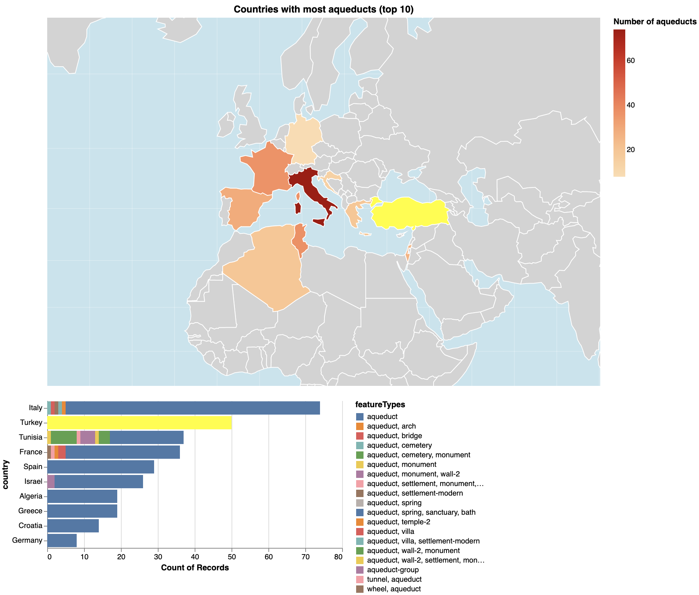
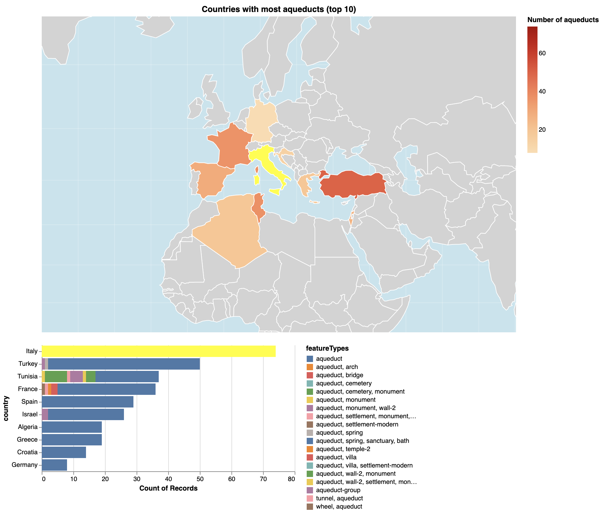

# Countries with most aqueducts (top 10)

##### Setup
```python
import altair as alt
import pandas as pd
import time
import requests
from vega_datasets import data
from geopy.geocoders import Nominatim
```


```python
df = pd.read_csv('pleiades.csv')
```

{(aim|}

People travelling all over Southern Europe and its surrounding territories can often notice the remains of beautiful arch-shaped (not always) bridges called aqueducts, some of which are part of the pleiades. The utlimate goal of this visualization is to present countries with the most of such. This can help indentify the spread of the aqueducts beyond the well-know locations of their centralization (e.g., Italy, Greece) and enable comparison between different countries.  

{|aim)}

{(vistype|}

Choropleth geographic map & stacked bar chart

{|vistype)}

### Altair code

```python
selection = alt.selection(type='single', on='mouseover', fields=['country'], empty='none')

bars = alt.Chart(kf).mark_bar().encode(
    x='count():Q',
    y=alt.Y('country:O', sort=alt.EncodingSortField(field="country", op="count", order='descending')),
    color=alt.condition(
        selection,
        alt.value('yellow'),
        'featureTypes:N'
    )
).add_selection(selection)

mp = data.world_110m.url
source = alt.topo_feature(mp, 'countries')

globe = alt.Chart(alt.sphere()).mark_geoshape(fill='lightblue', opacity=0.7)
meridian = alt.Chart(alt.graticule()).mark_geoshape(stroke='white', strokeWidth=0.3, opacity=0.8)

background = alt.Chart(source).mark_geoshape(
    stroke="white",
    fill="lightgray"
)

world_map = alt.Chart(source).mark_geoshape(
    stroke="white"
).encode(
     color=alt.condition(selection, alt.value('yellow'), alt.Color('counts:Q', legend=alt.Legend(title='Number of aqueducts'), scale=alt.Scale(scheme='orangered')))
).transform_lookup(
    lookup='id',
    # left joining to get the count and country name
    from_=alt.LookupData(sorted_gr, 'country_id', ['country', 'counts'])
).add_selection(
    selection
)

layered_map = alt.layer(
    globe,
    meridian,
    background,
    world_map,
).properties(
    width=750,
    height=500,
    title='Countries with most aqueducts (top 10)'
).project(
    'mercator',
    scale=330,
    center=[-50, 66],
)

chart = (layered_map & bars).configure_view(stroke=None)
```


```python
chart
```

### Examples & interaction
<br/>
<br/>

{(vismapping|}

<b>Map:</b>

Color (hue + saturation of the 'orangered' palette): count of aqueducts. Previous mappings: count of aqueducts => country => country_id => country_id in the map 'world_110m' dataset.
<b>Bar chart:</b>

x  position
:   count of aqueducts 

y  position
: country (Nominal)

within a bar:
featureType => color

{|vismapping)}

{(dataprep|}

Country mapping (including country id mapping), grouping, aggregation by total count of aqueducts, sorting and filtering. 

{|dataprep)}

```python
# filtering only those that contain "aqueduct"
df = df[(df['featureTypes'].str.contains("aqueduct"))]
```


```python
# executing the cell below requires time, so you can skip ahead and uncomment the 3rd cell
# getting the country name from the given coordinates
def get_country(lat, long, geolocator):
    time.sleep(2)
    string = f'{lat}, {long}'
    locationString = geolocator.reverse(string, language='en')
    if locationString is None:
        return 'Unknown'
    locationArr = locationString.address.split(', ')
    if locationArr == []:
        return 'Unknown'
    else: 
        return locationArr[-1]
```


```python
# applying the function
geolocator = Nominatim(user_agent="vis_cw")
df['country'] = df.apply(lambda row: get_country(row.reprLat, row.reprLong, geolocator), axis=1)
```


```python
# the operation above takes quite a while, so we save it for the further use
df.to_csv('pleiades_vis3_withCountry.csv')
```


```python
# uncomment the code below to read directly from the file (skip 3 cells above)
# df = pd.read_csv('pleiades_vis3_withCountry.csv')
```


```python
# grouping, sorting, selecting top 10
country_gr = df.groupby(['country'])
sorted_gr = country_gr.size().reset_index(name='counts').sort_values('counts', ascending=False).head(10)
```


```python
sorted_gr
```


<div>
<style scoped>
    .dataframe tbody tr th:only-of-type {
        vertical-align: middle;
    }

    .dataframe tbody tr th {
        vertical-align: top;
    }

    .dataframe thead th {
        text-align: right;
    }
</style>
<table class="dataframe">
  <thead>
    <tr style="text-align: right;">
      <th></th>
      <th>country</th>
      <th>counts</th>
    </tr>
  </thead>
  <tbody>
    <tr>
      <th>13</th>
      <td>Italy</td>
      <td>74</td>
    </tr>
    <tr>
      <th>23</th>
      <td>Turkey</td>
      <td>50</td>
    </tr>
    <tr>
      <th>22</th>
      <td>Tunisia</td>
      <td>37</td>
    </tr>
    <tr>
      <th>6</th>
      <td>France</td>
      <td>36</td>
    </tr>
    <tr>
      <th>20</th>
      <td>Spain</td>
      <td>29</td>
    </tr>
    <tr>
      <th>12</th>
      <td>Israel</td>
      <td>26</td>
    </tr>
    <tr>
      <th>1</th>
      <td>Algeria</td>
      <td>19</td>
    </tr>
    <tr>
      <th>8</th>
      <td>Greece</td>
      <td>19</td>
    </tr>
    <tr>
      <th>4</th>
      <td>Croatia</td>
      <td>14</td>
    </tr>
    <tr>
      <th>7</th>
      <td>Germany</td>
      <td>8</td>
    </tr>
  </tbody>
</table>
</div>


```python
unique = sorted_gr.country.to_numpy()
```


```python
unique
```


    array(['Italy', 'Turkey', 'Tunisia', 'France', 'Spain', 'Israel',
           'Algeria', 'Greece', 'Croatia', 'Germany'], dtype=object)


```python
# getting ids of each country in the list
r = requests.get('https://raw.githubusercontent.com/alisle/world-110m-country-codes/master/world-110m-country-codes.json')
d = r.json()
k = {}
for x in d:
    k[x['name']] = x['id']

dct = {}
for x in unique:
    dct[x] = k[x]
```


```python
kf = df[df['country'].isin(unique)]
```


```python
pd.options.mode.chained_assignment = None
kf['country_id'] = kf['country'].map(dct)
```


```python
sorted_gr['country_id'] = sorted_gr['country'].map(dct)
```


```python
sorted_gr
```


<div>
<style scoped>
    .dataframe tbody tr th:only-of-type {
        vertical-align: middle;
    }

    .dataframe tbody tr th {
        vertical-align: top;
    }

    .dataframe thead th {
        text-align: right;
    }
</style>
<table class="dataframe">
  <thead>
    <tr style="text-align: right;">
      <th></th>
      <th>country</th>
      <th>counts</th>
      <th>country_id</th>
    </tr>
  </thead>
  <tbody>
    <tr>
      <th>13</th>
      <td>Italy</td>
      <td>74</td>
      <td>380</td>
    </tr>
    <tr>
      <th>23</th>
      <td>Turkey</td>
      <td>50</td>
      <td>792</td>
    </tr>
    <tr>
      <th>22</th>
      <td>Tunisia</td>
      <td>37</td>
      <td>788</td>
    </tr>
    <tr>
      <th>6</th>
      <td>France</td>
      <td>36</td>
      <td>250</td>
    </tr>
    <tr>
      <th>20</th>
      <td>Spain</td>
      <td>29</td>
      <td>724</td>
    </tr>
    <tr>
      <th>12</th>
      <td>Israel</td>
      <td>26</td>
      <td>376</td>
    </tr>
    <tr>
      <th>1</th>
      <td>Algeria</td>
      <td>19</td>
      <td>12</td>
    </tr>
    <tr>
      <th>8</th>
      <td>Greece</td>
      <td>19</td>
      <td>300</td>
    </tr>
    <tr>
      <th>4</th>
      <td>Croatia</td>
      <td>14</td>
      <td>191</td>
    </tr>
    <tr>
      <th>7</th>
      <td>Germany</td>
      <td>8</td>
      <td>276</td>
    </tr>
  </tbody>
</table>
</div>


{(limitations|}

If we wanted to have a wider range of countries (e.g., 100), it would be very difficult to pick a country of interest from both the bar chart and the choropleth map. For the former it is evident due to limited space and for the latter it is hardly possible to pick a color map which can address subtle differencies in the value represented by color.

{|limitations)}
