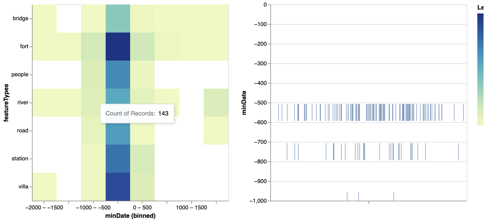
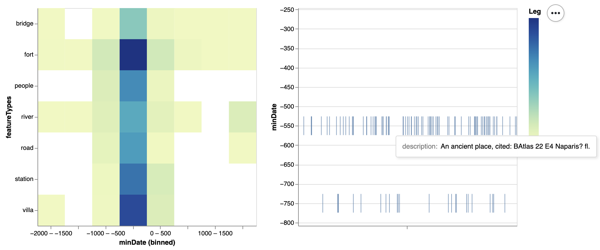

# Emergence of pleiades from different categories over the last 4000 years (excl. settlements)

This visualization fulfills the concept of "overview first, zoom and filter" (in our case - overview => filter => zoom) from the Shneiderman's mantra.

##### Setup
```python
import altair as alt
import pandas as pd
```


```python
df = pd.read_csv('pleiades.csv')
```

{(aim|}

We can figure out which types of pleiades were formed in the last 4000 years besides settlements (since this is by far the most common category) and determine their approximate date of emergence. Hence, we can establish whether there is a connection between certain time periods and categories. Also, we can examine each single location on the tick chart after selecting an interval of interest on the heatmap. 

{|aim)}

{(vistype|}

Heatmap & tick chart

{|vistype)}

### Altair code

```python
alt.data_transformers.disable_max_rows()
# selection a square of the heatmap
selection = alt.selection(type='single', encodings=['x', 'y'], empty='none')

heatmap = alt.Chart(df).mark_rect().encode(
    alt.X('minDate:O', axis=alt.Axis(labelAngle=0), bin=alt.Bin(step=500)),
    alt.Y('featureTypes:N'),
    # color is based on selection / this works only is one encoding (x | y) is specified in the selection above
    color=alt.condition(
        selection, alt.value('darkred'), alt.Color('count():Q', legend = alt.Legend(title = 'Legend')), 
    ),
    tooltip=["count():Q"]
).properties(
    width=350,
    height=350
).add_selection(selection)

tick = alt.Chart(df).mark_tick(height=30).encode(
    x=alt.X(
        'jitter:Q',
        title=None,
        axis=alt.Axis(values=[0], grid=False, labels=False),
        scale=alt.Scale(),
    ),
    y=alt.Y('minDate:Q'),
    tooltip=["description:N"]
).properties(
    width=320,
    height=320,
).transform_calculate(
    # a lot of ticks have the same position due to the nature of the data set, hence we have to apply bias to create a slight shift
    jitter='sqrt(-2*log(random()))*cos(2*PI*random())'
).transform_filter(
    selection
).interactive()

chart = (heatmap | tick).properties(title='Emergence of pleiades from different categories over the last 4000 years (excl. settlements)')
```


```python
chart
```

### Examples & interaction
Selecting a cell on the heatmap updates the chart showing ticks.
<br/>
We can also zoom in on the ticks on the right chart.
<br/>

{(vismapping|}

<b>Heatmap:</b>

Color (hue + saturation): count of records

x  position
:   binned minDate (1 bin = 500 years)

y  position
: featureTypes (Nominal)

<b>Tick chart:</b>

x  position
:  jitter - to avoid ticks overlaying each other

y  position
: minDate


{|vismapping)}

{(dataprep|}

Filtering by date of emergence, grouping by category and removing settlements / uncategorized data.

{|dataprep)}

```python
df = df[df['minDate'] >= -2000]
```


```python
featureType_gr = df.groupby(['featureTypes'])
sorted_gr = featureType_gr.size().reset_index(name='counts').sort_values('counts', ascending=False).head(10)
```


```python
unique = sorted_gr['featureTypes'].to_numpy()
```


```python
# we remove settlements due to their overwhelming supremacy
df = df[(df['featureTypes'].isin(unique)) & (~df['featureTypes'].str.contains("unknown")) & (~df['featureTypes'].str.contains("unlocated")) & (~df['featureTypes'].str.contains("settlement"))]
```

{(limitations|}

Selection on the heatmap is not highlighted due to the limitations of binning in vega-lite. Binning itself is also limited in order to accumulate fewer points in a bin to prevent from excessive memory consumption. The use of jitter might have a flip side - it might not be clear why the ticks have a different (uneven) horizontal spatial position. The use of minDate instead of mean(minDate, maxDate) might be questionable, however, it provides more reliablity. 

{|limitations)}
