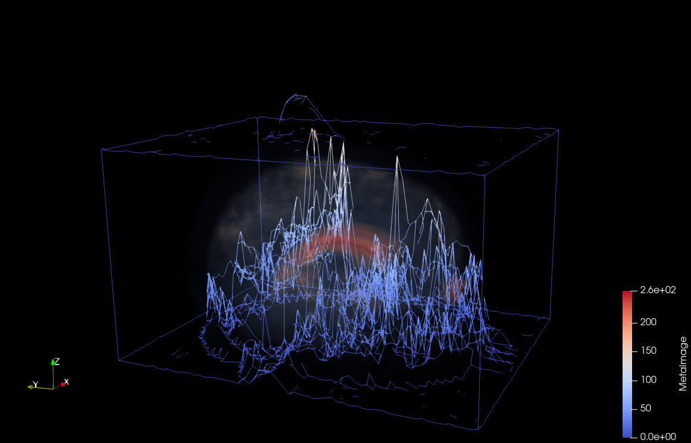
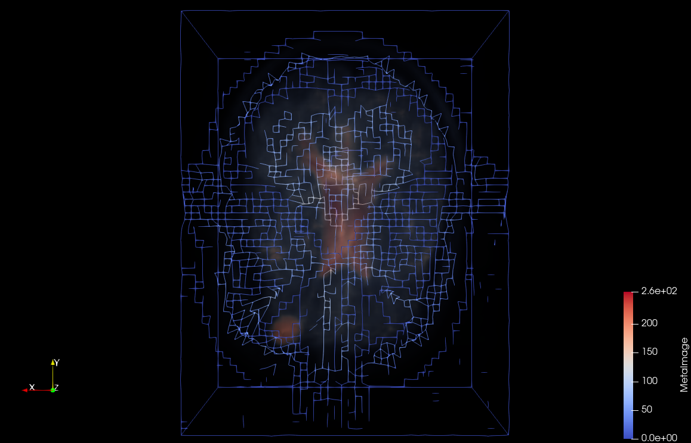
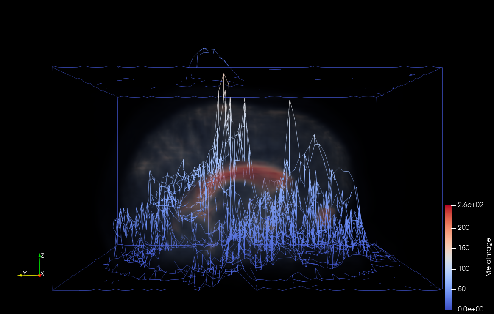

---
elm:
  dependencies:
    gicentre/elm-vegalite: latest

narrative-schemas:
  - coursework
---

Author: Anton Dementyev (2023638)
CSCM37 Coursework 2: Volume Visualization

# Head MRI Localized 

{(aim|}

With the aid of this visualization diagnosts and oncologists can potentially detect, describe and evaluate geometric parameters of all possible kinds of tumor or hematomas in the brain of a patient, as well as chemical ones. It is important for the selection of a therapy, especially when speaking about highly precise methods (e.g., gamma knife), where determining the configuration is vital.

{|aim)}

{(vistype|}

Feature edges + direct volume

{|vistype)}

 
 
 

{(vismapping|}

Color mapping:

We have selected the default cool-to-warm palette as the basis the our color mapping. Data values = [0; 255].

<ul>
  <li>
    Cerebral cortex, spikes (bottom): blue, data values: ~[0; 50];
  </li>
  <li>
    Cerebral cortex (gaps), spikes (mid): white, data values: ~[50; 150];
  </li>
  <li>
    Corpus, eyes, spikes (top): red, data values ~ [150; 255];
  </li>
</ul>

Opacity mapping:

For the volume (head):
<ul>
  <li>
    Cerebral cortex: ~ [0; 0.03];
  </li>
  <li>
    Corpus, eyes: ~ [0.03; 0.25];
  </li>
</ul>

{|vismapping)}

{(dataprep|}

1. Subset extraction:
Cutting to the nasal area:
z-axis (0 - 41) -> (6 - 41)

2. Warping by scalar
Scale factor - 1

{|dataprep)}

{(limitations|}

First, the magnitude of the volumetric spikes is very relative. In essense, it is amplfied in the selected way purely to make the comparison between them illustrative enough, but does not represent the actual depth. Also, we need to use an extra component (head) to make it clear where the spikes are.

{|limitations)}

