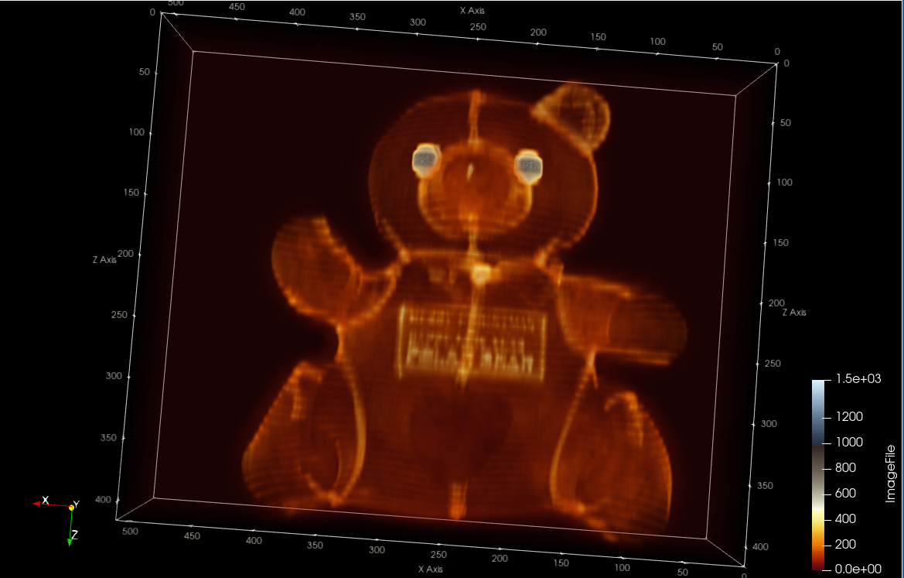
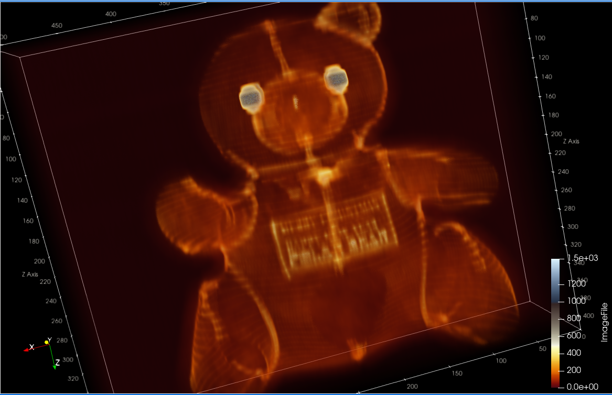
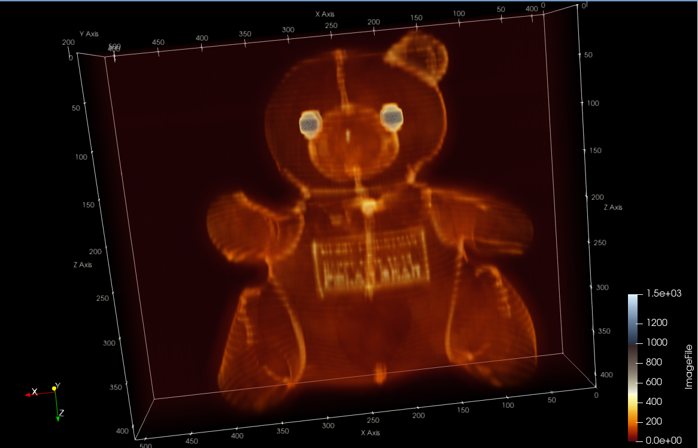

Bear declassified.

{(aim|}

We can learn what is written on the belly of the teddy bear. Potentially, this can help us determine its origin (place of sale / manufacturing) or why it was acquired (e.g., a New Year / Christmas present). 

{|aim)}

{(vistype|}

Volume Clip Visualization

{|vistype)}

 
 
 

{(vismapping|}

Color mapping:

Yellow - gray - blue palette

Seams: 
Body:
Eyes:
Rest of Volume:

Opacity mapping:

Seams, letter: 0.65 - 1
Bear insides, volume around the bear: ~ 0.04
Eyes: ~ 1

{|vismapping)}

{(dataprep|}
1. Data Spacing -> z-axis x 6.7 times
2. Subset extraction:
To remove the surface the bear is leaning on with extract the susbset within the y-axis: (0 — 511) -> (230 — 350)

{|dataprep)}

{(limitations|}

Unfortunately, even though the text is rather undestandable (presumably, "MERRY CHRISTMAS HAPPY NEW YEAR POLAR BEAR"), we cannot distinguish some letters (e.g., letter "R") and have to deduce the word through its context. However, we have not found other ways (e.g., switching opacity of the bear's insides to lower values) to apmplify resolution of certain letter without sacrifising the resolution of others. In addition, the color mappings used for enhancing the perception of the text may deviate from its user's cognitive bias and they may find the visualization daunting. 

{|limitations)}
