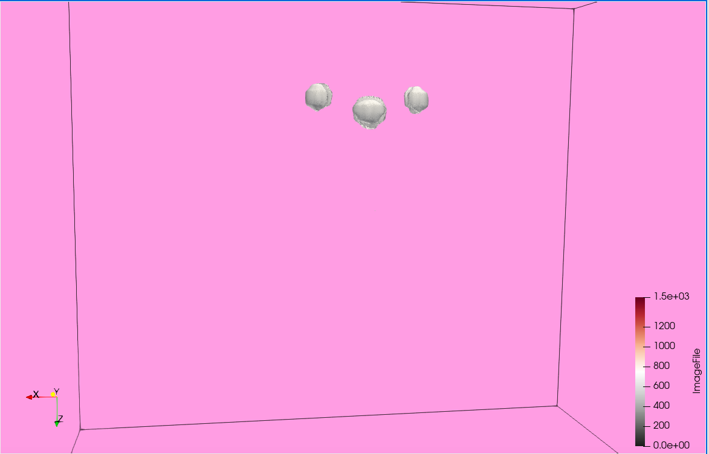
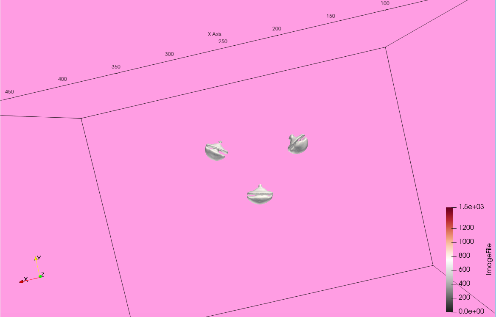
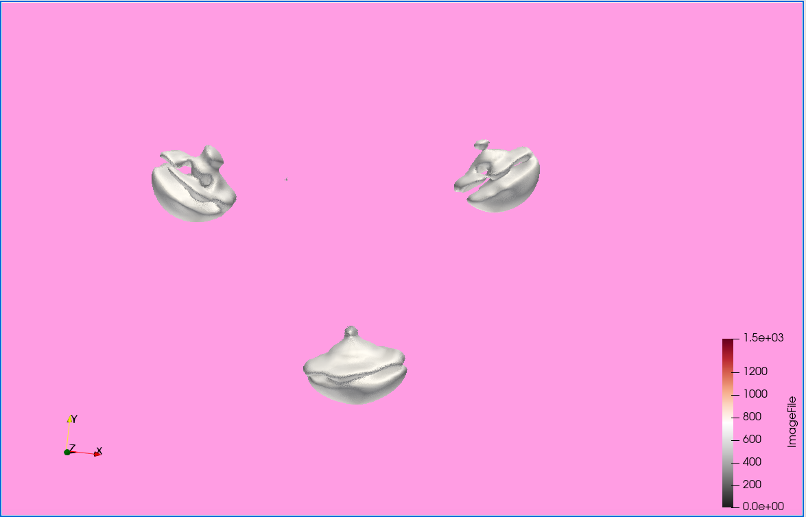

# I'm in Love with the Shape of You (Buttons)

{(aim|}

We can discover the physical structure of the buttons on the bear and understand how they are attached to the body. Also, we can learn if buttons on the nose and the eyes are anyhow different.

{|aim)}

{(vistype|}

Isosurface

{|vistype)}

 
 
 

{(vismapping|}

We have selected the Gray and red palette as the basis the our color mapping. Further we only mention the mappings for the buttons, as other elements do not get displayed after applying isosurface rendering. 

Color mapping:

<ul>
    <li>
        Buttons: gray, data values: ~ [0; 750].
    </li>
</ul>

Opacity mapping:

<ul>
    <li>
        Buttons: ~ [0.6; 1].
    </li>
</ul>

{|vismapping)}

{(dataprep|}

1. Data Spacing -> z-axis x 6.7 times
2. Subset extraction:
To remove the surface the bear is lying on, with extract the susbset within the y-axis: (0 — 511) -> (0 — 370)

Also, volume rendering blend mode is set to isosurfacing with shades enabled.

{|dataprep)}

{(limitations|}

Although we can get a sense of the overall shape of the buttons and some pecularities of each type of button, we cannot take away much upon a very close inspection of them as the isosurface becomes disintegrated. Also, it might be a bit difficult to determine the orientation of the visualization right away, since the buttons are fairly similar at first glance. Still, it becomes understandable quite quickly. Finally, a minor limitation is that it is a bit computationally expensive to run, even without the axes displayed. 

{|limitations)}
