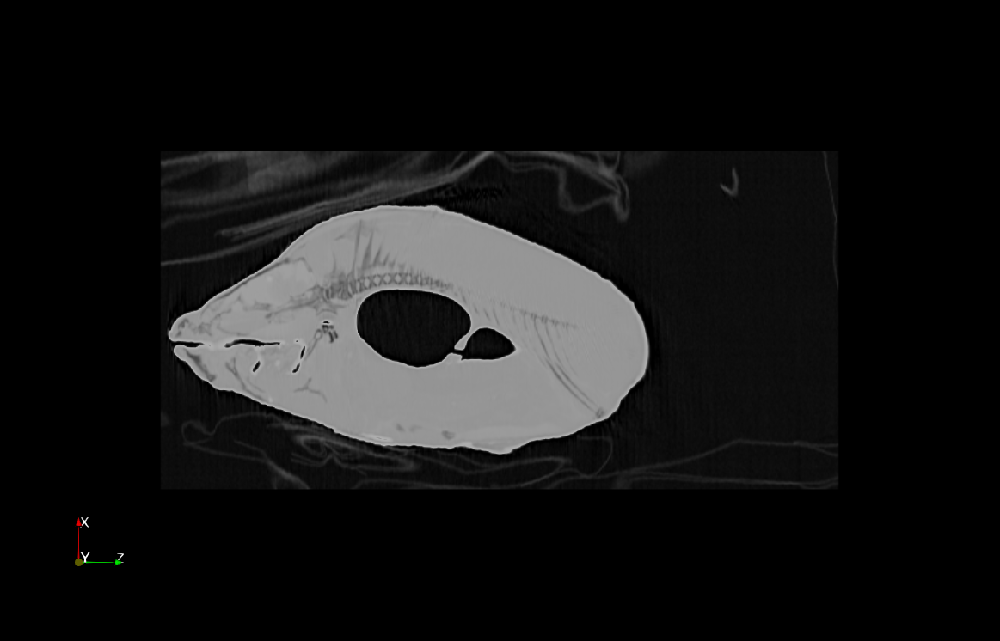
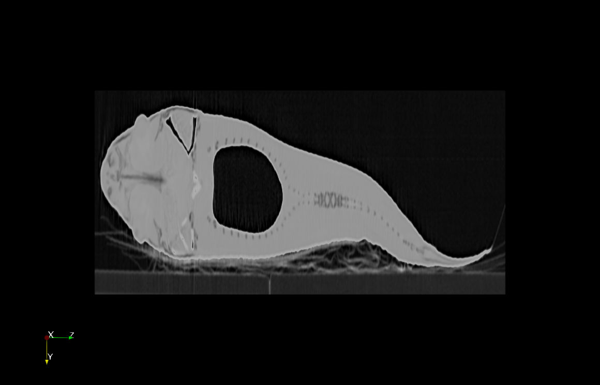

# Swim Bladder Gives You Wings

{(aim|}

We can learn what the structure, shape and possibly the volume of the fish's swim bladder is. All three can be useful for comparing various types of fish in ichthyological contexts.

{|aim)}

{(vistype|}

Slice

{|vistype)}

 
 

{(vismapping|}

We have selected the X-ray palette as the basis the our color mapping. 

Color mapping:

<ul>
    <li>
        Body — {swim bladder, other gaps}: white / gray, data values: ~[0; 2501];
    </li>
    <li>
        Swim bladder: black, data values ~ [2501; 2871].
    </li>
</ul>

Opacity mapping:

<ul>
    <li>
        Body — {swim bladder, other gaps}: ~[0.77; 0.93];
    </li>
    <li>
        Swim bladder: ~[0.93; 1].
    </li>
</ul>

{|vismapping)}

{(dataprep|}

Slice extraction:
<table>
    <thead>
        <tr>
            <td>Property</td>
            <td>X</td>
            <td>Y</td>
            <td>Z</td>
        <tr>
    </thead>
    <tbody>
        <tr>
            <td>Origin</td>
            <td>127.5</td>
            <td>127.5</td>
            <td>255.5</td>
        <tr>
        <tr>
            <td>Normal (image 1)</td>
            <td>0</td>
            <td>-1</td>
            <td>0</td>
        <tr>
        <tr>
            <td>Normal (image 2)</td>
            <td>1</td>
            <td>0</td>
            <td>0</td>
        <tr>
    </tbody>
</table>

{|dataprep)}

{(limitations|}

We cannot really see at which stage of inflation the swim bladder is, so we need to know the state of the fish prior to analysing the swim bladder's aforementioned properties. Also, as this is a slice, perhaps undestanding how smooth / homogeneous the surface of the swim bladder is, is a bit problematic.

{|limitations)}
