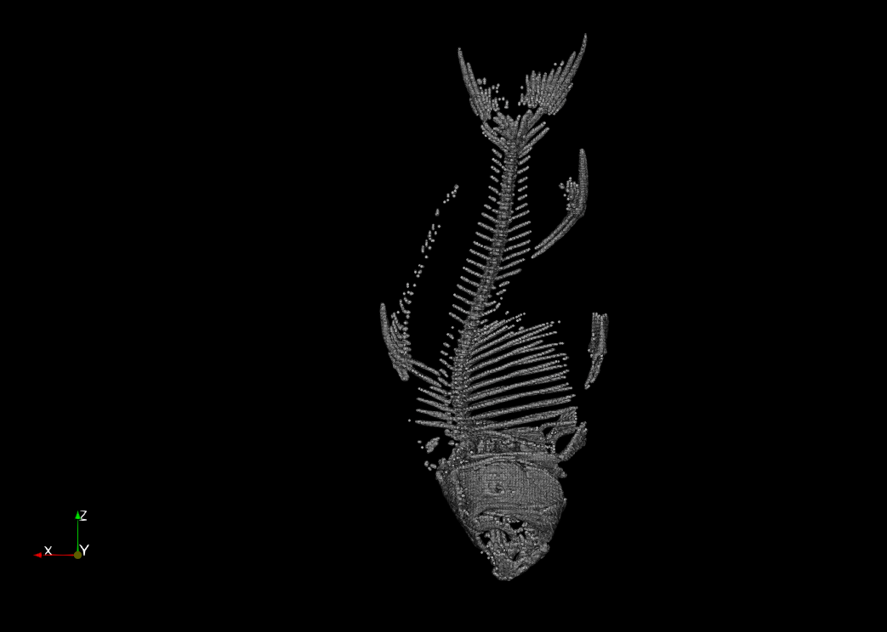

# Fish Skeleton

{(aim|}

We can understand the bones' structure of a fish usign this visualization. However, its lower-level purpose is displaying the spinal region of the fish, with an emphasis on how it can flex during movement. The latter can be useful, for instance, when studying factors impacting the speed of certain fish. 

{|aim)}

{(vistype|}

Gaussian Points (Isosurface)

{|vistype)}

 
 
 
 
 
 

{(vismapping|}

Not part of the transfer function (it was not used for this visualization):

<ul>
    <li>
        Skeleton (point) opacity -> 0.3;
    </li>
    <li>
        Sketelon point radius -> 1.49.
    </li>
</ul>

{|vismapping)}

{(dataprep|}

Contour extraction.

{|dataprep)}

{(limitations|}

A minor limitation is that some parts of the head's bone structure are not fully distinguishable. Hence, as mentioned before, this visualization is more applicable for examining the spine of the fish. At the same time, the main advantage of gaussian points is displaying the connectity between voxels. Due to this notion, it is really effective when the fish is turned sideways, but is not so effective from above (e.g., with respect to making out each vertebra from a distance, like in the 1st image). For our outlined purpose, we do not think that the visualization has a lot of room for improvement. However, if we used an isosurface only, the visibility of the details of the smaller bones could be enhanced using ray tracing, but in fact gaussian points still provide a lot more information in that sense.

{|limitations)}
